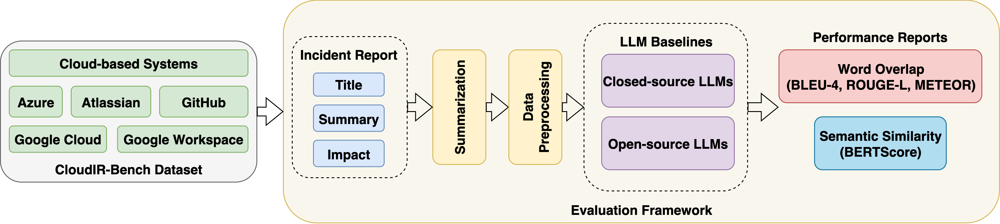
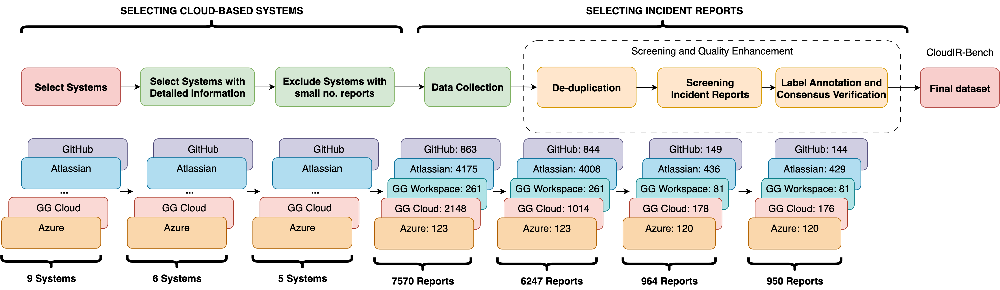

# CloudIR-Bench

## 📖 Abstract



Root cause analysis (RCA) and mitigation prediction are essential for incident management, enabling the identification of underlying causes of failures and ensuring the reliability and availability of complex cloud-based systems. With the rise in incident volume and system complexity, incident reports have become a valuable resource for RCA and mitigation prediction, especially when paired with Large Language Models (LLMs). Despite recent advances, progress in this field is hindered by the lack of publicly available datasets. Existing work relies on private and organization-specific data, hindering transparency, reproducibility, and generalizability. To address this gap, we introduce CloudIR-Bench, the first publicly available dataset and benchmark for RCA and mitigation prediction in cloud-based systems using incident reports. Curated from incident reports across five leading cloud providers, CloudIR-Bench captures a diverse range of real-world scenarios. Besides, we also release an open-source evaluation framework that includes nine state-of-the-art LLM-based approaches for these tasks, promoting reproducibility and advancing research in this domain. Our benchmarking results reveal both the potential capabilities and limitations of existing LLMs in RCA and mitigation prediction. The dataset, construction code, and benchmarking framework are publicly available at <https://github.com/hoangtnm/CloudIR-Bench>.

## 🎯 Key Features

- **First public incident report dataset:** Curated from five major cloud systems, representing a wide spectrum of production incidents.

- **Comprehensive annotations:** Includes root causes, mitigation actions, timestamps, workarounds, preventive actions, and more.

- **Long-context & metadata:** Supports deep understanding and modeling of incident lifecycle and dependencies.
- **Open-source evaluation framework:** Implements nine state-of-the-art LLM-based RCA and mitigation baselines.
- **Reproducible experiments:** Standard APIs and modular design for seamless integration and benchmarking.

## 📊 Dataset Overview



CloudIR-Bench contains incident reports with structured annotations including:

- **Incident Metadata**: Title, severity, status, timestamps
- **Root Cause Analysis**: Detailed technical explanations
- **Mitigation Strategies**: Short-term and long-term solutions
- **Impact Assessment**: Affected services and customer impact
- **Resolution Timeline**: Step-by-step incident resolution process

### Dataset Statistics

| **Attribute**        | **Description**           | **Azure** | **Google Cloud** | **Google Workspace** | **GitHub** | **Atlassian** |
| -------------------- | ------------------------- | --------- | ---------------- | -------------------- | ---------- | ------------- |
| Title                | Incident title            | 120       | 176              | 81                   | 144        | 429           |
| Summary              | Incident summary          | 120       | 176              | 81                   | 144        | 428           |
| Impact               | Reported impact           | 0         | 175              | 81                   | 0          | 155           |
| Root cause           | Cause of the incident     | 119       | 175              | 81                   | 142        | 394           |
| Mitigation           | Resolution actions        | 119       | 148              | 76                   | 134        | 355           |
| Long-term mitigation | Preventive measures       | 100       | 86               | 69                   | 125        | 175           |
| Workaround           | Temporary fix             | 1         | 6                | 1                    | 0          | 1             |
| Updates              | Timeline of actions/notes | 20        | 176              | 81                   | 144        | 424           |
| Severity             | Incident severity         | 120       | 176              | 81                   | 144        | 429           |
| Status               | Current status            | 120       | 176              | 81                   | 144        | 429           |
| Start_timezone       | Detection timezone        | 120       | 176              | 81                   | 144        | 429           |
| Start_time           | Detection time            | 120       | 176              | 81                   | 144        | 429           |
| End_timezone         | Resolution timezone       | 120       | 176              | 81                   | 144        | 429           |
| End_time             | Resolution time           | 120       | 176              | 81                   | 144        | 429           |

> **Note:** As the CloudIR-Bench paper is currently under review, only three sample incident reports from each system are publicly released at this time. The full dataset will be made available upon publication. Stay tuned for updates!

## 🚀 Quick Start

### Prerequisites

- **Python**: 3.10 or higher
- **Memory**: 32GB+ RAM recommended
- **GPU**: CUDA-compatible GPU with 40GB+ VRAM for optimal performance (tested on 2x NVIDIA A100-PCIE-40GB)
- **NVIDIA Driver**: 525.60.13+ (for CUDA 12.0 support)

### Installation

1. **Clone the repository**

```bash
git clone https://github.com/hoangtnm/CloudIR-Bench.git
cd CloudIR-Bench
```

2. **Create and activate a conda environment**

```bash
conda create -yn CloudIR-Bench python=3.10
conda activate CloudIR-Bench
```

3. **Install dependencies**

```bash
# Install uv for fast package management
python3 -m pip install uv

# Install all required packages
uv pip install -r requirements.txt
```

## Usage

### Crawling Incident Reports

```bash
# From src directory
# Notes: these systems frequently update their websites, so these scripts may need to be updated periodically.
python crawl_azure.py -o azure 
python crawl_atlassian.py -o atlassian
python crawl_github.py -o github
python crawl_google_cloud.py -o google_cloud --platform cloud
python crawl_google_workspace.py -o google_workspace --platform workspace
```

### Labeling Incident Reports

```bash
# From src directory
streamlit run streamlit_app.py
```

### Generating Summarizations

You can generate LLM-based summarizations for incident annotations using OpenAI Batches and the provided scripts.

**Step 1: Prepare batch jobs for OpenAI Batches**

Use the provided script to generate JSONL files containing requests for LLM-based summarization. Run the following commands from the `src` directory for each provider:

```bash
python summarize_labels.py --engine api --model gpt-3.5-turbo-0125 -i ../data-samples/azure/annotations/final.json
python summarize_labels.py --engine api --model gpt-3.5-turbo-0125 -i ../data-samples/atlassian/annotations/final.json
python summarize_labels.py --engine api --model gpt-3.5-turbo-0125 -i ../data-samples/github/annotations/final.json
python summarize_labels.py --engine api --model gpt-3.5-turbo-0125 -i ../data-samples/google_cloud/annotations/final.json
python summarize_labels.py --engine api --model gpt-3.5-turbo-0125 -i ../data-samples/google_workspace/annotations/final.json
```

Each command will produce a batch request file in the corresponding `annotations_summarization` directory, e.g.:

- `../data-samples/azure/annotations_summarization/gpt-3.5-turbo-0125_001_of_001_requests.jsonl`
- `../data-samples/atlassian/annotations_summarization/gpt-3.5-turbo-0125_001_of_001_requests.jsonl`
- (repeat for other systems)

These files are ready to be submitted to [OpenAI Batches](https://platform.openai.com/batches) for processing.

**Step 2: Submit jobs to OpenAI Batches and download the results**

1. Go to [OpenAI Batches](https://platform.openai.com/batches) and upload the generated JSONL request files for each system.
2. Start the batch processing and wait for completion.
3. Download the results (JSONL format) from the OpenAI platform.
4. Place each result file in the corresponding `annotations_summarization` directory, matching the system, e.g.:
   - `../data-samples/azure/annotations_summarization/gpt-3.5-turbo-0125_001_of_001_results.jsonl`
   - `../data-samples/atlassian/annotations_summarization/gpt-3.5-turbo-0125_001_of_001_results.jsonl`
   - (repeat for other systems)

**Tip:**  
Ensure the result filenames match the expected pattern for seamless merging

**Step 3: Merge summarization results into the final annotation files**

```bash
python scripts/summarize_labels.py --engine api --model gpt-3.5-turbo-0125 \
  -i ../data-samples/azure/annotations/final.json \
  --batch_output ../data-samples/azure/annotations_summarization/gpt-3.5-turbo-0125_001_of_001_results.jsonl
python scripts/summarize_labels.py --engine api --model gpt-3.5-turbo-0125 \
  -i ../data-samples/atlassian/annotations/final.json \
  --batch_output ../data-samples/atlassian/annotations_summarization/gpt-3.5-turbo-0125_001_of_001_results.jsonl
python scripts/summarize_labels.py --engine api --model gpt-3.5-turbo-0125 \
  -i ../data-samples/github/annotations/final.json \
  --batch_output ../data-samples/github/annotations_summarization/gpt-3.5-turbo-0125_001_of_001_results.jsonl
python scripts/summarize_labels.py --engine api --model gpt-3.5-turbo-0125 \
  -i ../data-samples/google_cloud/annotations/final.json \
  --batch_output ../data-samples/google_cloud/annotations_summarization/gpt-3.5-turbo-0125_001_of_001_results.jsonl
python scripts/summarize_labels.py --engine api --model gpt-3.5-turbo-0125 \
  -i ../data-samples/google_workspace/annotations/final.json \
  --batch_output ../data-samples/google_workspace/annotations_summarization/gpt-3.5-turbo-0125_001_of_001_results.jsonl
```

### Generating Root Cause and Mitigation Prediction

```bash
# From src directory
python pipeline_predict.py --datasets azure atlassian github google_cloud google_workspace --data_dir ../data-samples
```

### Running Evaluation

```bash
# From src directory
python evaluate_preds.py --data_dir ../data-samples                                             
```

## 📞 Contact

For questions, issues, or research collaboration opportunities, please:

- **Open an issue**: Submit bug reports or feature requests on [GitHub Issues](https://github.com/hoangtnm/CloudIR-Bench/issues)
- **Email the authors**: [s4075740@student.rmit.edu.au](mailto:s4075740@student.rmit.edu.au)
- **Research collaborations**: We welcome academic partnerships and industry collaborations

### Citation

If you use CloudIR-Bench in your research, please cite our work:

```bibtex
@misc{tran2025cloudIR,
  title={CloudIR-Bench: A Dataset and Benchmark for Root Cause Analysis and Mitigation Prediction of Cloud-based Systems},
  author={Hoang, Tran and Huong, Ha and Tran, Tri Dang and Jeffrey, Chan and Hongyu, Zhang},
  year={2025},
  url={https://github.com/hoangtnm/CloudIR-Bench}
}
```
